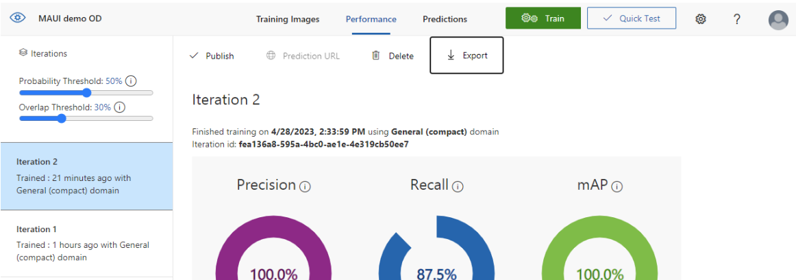
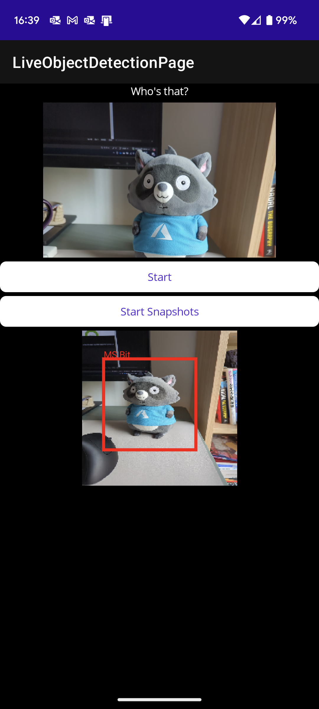

# MAUI-OD-demo

Object Detection using .NET MAUI and Azure Custom Vision using exported ONNX models.

This is a very ameteur demo prepared for simple POC and it's not really intended to be useful in any capacity. Not even a second was spent on performance or general usability so be warned!

I should also disclose the maths to determine how to draw the bounding boxes and overlaying that onto a bitmap image was not thought through with much precision so it's likely that it's not accurate.

The implementation was largely based on [ONNX Console Sample from Microsoft](https://learn.microsoft.com/en-us/dotnet/machine-learning/tutorials/object-detection-onnx), where the code was adapted for .NET MAUI.

Tested and demonstrated publicly during a talk using Android and iOS devices. Current implementation doesn't work on windows/mac but with .NET MAUI it's possible to overcome them - I haven't explored how to run on them just yet. 
Very happy to receive PRs if you put the energy into making that work!

But I'm also happy to receive requests for that use case, if you want it.


# Instructions

This repo has an example ONNX file that was trained to pick up an object, so you can use that to confirm functionality.
Use the image: assets -> images -> frame60.png as an example.

Normal .NET MAUI requirements for running on devices - if you want to run on iOS devices you do need to have the right provisioning profiles downloaded using Apple's developer portal, but you should be able to run on simulators too.

To use your own model:

1. Using your own Azure account, setup a new Azure Custom Vision resource (not Azure Computer Vision!). You can do this for free.
2. When both Training and Prediction resources are created, setup your project on [vision portal](https://customvision.ai/)
3. Setup your vision project
	1. During setup, select Object Detection, not image classification
	1. Remember to select domains that are (compact). This repo was created with general (compact) domain - not the general s1 domain
4. Train and export your model
	1. Using vision portal, do the training and test out predictions.
	2. Once you're content, go to Performance -> select Iteration -> Export 
	
	3. Select ONNX and download the .zip file
	3. Unarchive the .zip file and see that it has a model.onnx file
5. Replace exiting model file in assets -> Model -> model.onnx
6. Update YoloParser -> ExportedYoloOutputParser.cs to add your tags in labels field, and also update the class count to match the number of elements in that array:

``` CSharp

public const int CLASS_COUNT = 1;

private string[] labels = new string[]
{
    "MS Bit"
};
```

That's it.

Once running the app on your prefered device, you'll be presented with 2 buttons near the middle. 

Start button on top => starts/stops camera feed.
Start shapshot button on bottom => starts/stops very simple timer logic to capture snapshot from camera feed, store, process, and update processed image.

You should see something like the following:


